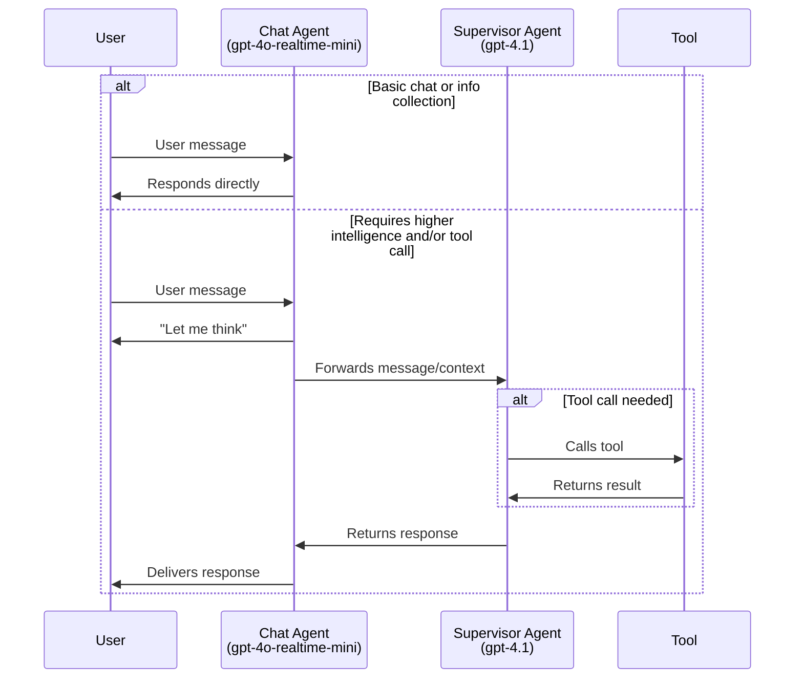

# Vending Machine AI Personalities Demo

An interactive vending machine AI system featuring multiple personality types built on real-time voice interaction technology. This project demonstrates how different AI personalities can engage customers in unique ways to enhance the vending experience.

## Personalities

The system features three distinct AI personalities:

1. **Farida (v1):** The professional baseline - a balanced personality that combines charisma with professionalism. Handles basic tasks efficiently while maintaining a neutral, welcoming tone.

2. **Kareem (v2):** The playful companion - designed for younger audiences with a childlike, joking demeanor. More informal and playful to create an engaging experience for children.

3. **Bean (v3):** The attention grabber - maximally focused on capturing and maintaining customer attention. Acts as a novelty feature to demonstrate the AI's potential for customer engagement.

## Features

- **Real-time voice interaction** with low-latency responses
- **Split-screen mode** for enhanced user experience with visual elements
- **Full-screen mode** for immersive interaction
- **Inventory management** with real-time product availability
- **Natural conversation flow** with context-aware responses
- **Multiple interaction modes** for different use cases

## Screenshots

### Full Screen Mode

*Full screen interaction mode for immersive customer experience*

### Split Screen Mode

*Split screen view showing AI interaction with product information panel*

### Farida Personality Demo

*Farida personality demonstrating instant inventory access and professional greeting (<1s response time)*

## Setup

1. **Install dependencies:**
   ```bash
   npm i
   ```

2. **Configure API Key:**
   - Add your `OPENAI_API_KEY` to your environment
   - Either add it to your `.bash_profile` or equivalent
   - Or copy `.env.sample` to `.env` and add it there

3. **Start the development server:**
   ```bash
   npm run dev
   ```

4. **Open in browser:**
   Navigate to [http://localhost:3000](http://localhost:3000)

5. **Select personality:**
   Use the "Scenario" dropdown in the top right to switch between personalities

## User Modes

For detailed information about the different user modes and how to switch between them, see [USER_MODE_GUIDE.md](USER_MODE_GUIDE.md).

## Technical Architecture

This Next.js TypeScript application uses real-time AI agents to create natural voice interactions:

- **Chat Agent** (gpt-4o-realtime-mini) - Handles immediate responses and basic conversations
- **Supervisor Agent** (gpt-4.1) - Manages complex tool calls and advanced responses
- **Tool Integration** - Real-time inventory checks, product information, and transaction processing

### How It Works



## Customization

To create your own AI personality:

1. **Create a new agent config** in `src/app/agentConfigs/`
2. **Define personality traits** in the agent instructions
3. **Configure tools** specific to your use case
4. **Add to the config** in `src/app/agentConfigs/index.ts`
5. **Select from UI** using the Scenario dropdown

Each agent config can define:
- Custom instructions and personality
- Specific tools and capabilities
- Tool logic for handling various interactions
- Handoff rules for multi-agent scenarios

## UI Navigation

- **Scenario dropdown** - Select different AI personalities
- **Agent dropdown** - Switch between specific agents
- **Left panel** - Conversation transcript with tool calls and responses
- **Right panel** - Event log showing client and server events
- **Bottom controls** - Disconnect, voice activity detection/PTT toggle, audio playback, and log toggles

## Project Structure

- `/src/app/agentConfigs/` - Agent personality definitions
- `/src/app/agentConfigs/vendingManager/` - Main vending machine agent (Farida)
- `/public/` - Static assets including screenshots and images
- `/src/app/App.tsx` - Main application logic and guardrails

## Contributing

This project demonstrates AI personality design for customer-facing applications. Feel free to explore the code and create your own personality variations.

## Built With

- Next.js
- TypeScript
- Real-time AI voice technology
- WebRTC for low-latency communication
